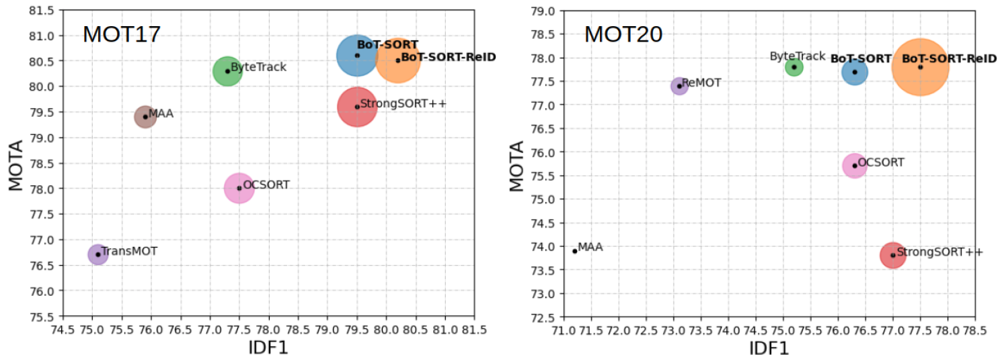
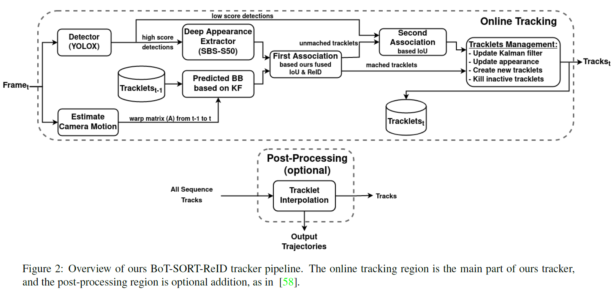
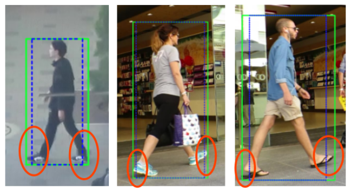
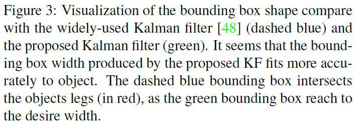

# BoT-SORT (BoT-SORT: Robust Associations Multi-Pedestrian Tracking)

[***arXiv preprint paper***](https://arxiv.org/abs/2206.14651)

[***GitHub***](https://github.com/NirAharon/BoT-SORT)

---

# GitHub Repository

## Installation

### Step 1. Create an environment and install PyTorch

Install torch and matched torchvision from [pytorch.org](https://pytorch.org/get-started/locally/).

```bash
virtualenv venv
pip install torch==1.12.1+cu113 torchvision==0.13.1+cu113 torchaudio==0.12.1 --extra-index-url https://download.pytorch.org/whl/cu113
```

### Step 2. Install BoT-SORT and YOLOv7 requirements

```bash
git clone https://github.com/NirAharon/BoT-SORT.git
cd BoT-SORT
pip3 install -r requirements.txt
pip3 install -r ./YOLOv7/requirements.txt
python3 setup.py develop
```

### Step 3. Install pycocotools

```bash
pip3 install cython
pip3 install pycocotools
```

### Step 4. Others

```bash
pip3 install cython_bbox      # cython_bbox
pip3 install "numpy<1.24"
pip3 install faiss-gpu        # faiss cpu / gpu
```

Note that the version of Numpy should be lower than 1.24.

## Download Pretrained Models

1. ByteTrack YOLOX ([bytetrack_x_mot17.pth.tar](https://drive.google.com/file/d/1P4mY0Yyd3PPTybgZkjMYhFri88nTmJX5/view?usp=sharing))
2. YOLOv7 ([yolov7-d6.pt](https://github.com/WongKinYiu/yolov7/releases/download/v0.1/yolov7-d6.pt))
3. ReID Models ([MOT17-SBS-S50](https://drive.google.com/file/d/1QZFWpoa80rqo7O-HXmlss8J8CnS7IUsN/view?usp=sharing), [MOT20-SBS-S50](https://drive.google.com/file/d/1KqPQyj6MFyftliBHEIER7m_OrGpcrJwi/view?usp=sharing))

## Demo

```bash
# Demo with BoT-SORT-ReID based on YOLOv7 and multi-class.
python3 .\tools\mc_demo_yolov7.py --weights .\pretrained\yolov7-d6.pt --source <path_to_video/images> --fuse-score --agnostic-nms --with-reid
```

# Paper Study



## 1. Introduction

目前大多數多目標追蹤（Multiple Object Tracking, MOT）任務都是採用 Tracking-by-Detection 範式。這種方法主要通過**物件追蹤步驟**、**追蹤步驟**兩步驟完成。其中，追蹤步驟又可以再細分成兩步驟：

1. 用於預測後續幀中軌跡的邊界框的運動模型和狀態估計，卡爾曼濾波（Kalman Filter, KF）是最主流的方法。
2. 將新的幀的檢測目標與目前軌跡相關聯。

在關聯步驟中，有兩種主要的方法：

1. 計算預測軌跡的邊界框以及新檢測目標的邊界框之間的 IoU（Intersection-over-union）。
2. 搭配外觀模型提取外觀特徵。

作者提出，目前大多的 SORT-like 演算法都面臨以下問題：

1. 卡爾曼濾波是一個恆速（constant-velocity）模型。然而，使用 IoU 進行關聯需要有較高質量的預測邊界框，而遮擋（occlusions）、漏檢（missed detections）、相機移動（camera motion）都會大大影響預測結果。
2. 目前大多追蹤器（如：DeepSORT）都是估計邊界框的長寬比，而非直接預測長、寬，容易導致估計的邊界框尺寸存在誤差。
3. 在許多 SORT-like 演算法中，容易在檢測器的能力（MOTA）和追蹤器的能力（IDF1）間進行權衡。也就是說，使用 IoU 通常可以實現更高的 MOTA，使用 Re-ID 則可以實現更高的 IDF1。

## 2. Related Work

## 3. Proposed Method



### 3.1. Kalman Filter





在傳統 SORT 方法中，狀態向量 $x=[x_c, y_c,s,a,\dot{x_c},\dot{y_c},\dot{s}]^T$，其中 $s$ 是邊界框在整個畫面中的占比，$a$ 是邊界框的長寬比。現在也有許多方法採用八元組的狀態向量 $x = [x_c, y_c, a, h, \dot{x_c}, \dot{y_c}, \dot{a}, \dot{h}]^T$。但是上述兩種方法都不是直接預測邊界框的長、寬，因此容易導致估計的邊界框不準確，而在後續計算 IoU 時產生不好的影響。

因此，作者提出直接預測邊界框長、寬之狀態向量 $x=[x_c(k),y_c(k), w(k), h(k), \dot{x_c(k)},\dot{y_c(k)}, \dot{w(k)}, \dot{h(k)}]$

### 3.2. Camera Motion Compensation (CMC)

Tracking-by-detection 的追蹤器非常依賴估計的邊界框。然而，若是在動態相機的情況下，卡爾曼濾波所預測的邊界框就容易存在問題。因此，作者提出相機運動補償（Camera Motion Compensation, CMC），利用影像配準技術，計算相機的剛性運動，再結合至卡爾曼濾波中。

作者使用 RANSAC 來計算仿射矩陣（Affine matrix） $A^{k}_{k-1} \in \mathbb{R}^{2 \times 3}$，使用這種稀疏配準技術可以較好地忽略前景，以更好地估計背景移動。

### 3.3. IoU - Re-ID Fusion

作者提出一個融合運動（IoU 距離矩陣）、外觀信息（餘弦距離矩陣）的方法。首先，低餘弦相似度或是 IoU 距離較遠的候選框會被拒絕匹配。其次，使用矩陣中每個元素的最小值作為成本函數的值。因此 IoU-ReID 融合公式可由以下表示：

$$
\hat{d}^{cos}_{i,j}=\left\{\begin{matrix}0.5\cdot d^{cos}_{i,j} & , &(d^{cos}_{i,j}<\theta_{emb}) \wedge (d^{iou}_{i,j} < \theta_{iou}) \\ 1 & , &\text{otherwise} \end{matrix}\right.
$$

$$
C_{i,j}=min\left\{d^{iou}_{i,j}, \hat{d}^{cos}_{i,j}\right\}
$$

其中，$d^{iou}_{i,j}$ 是第 $i$ 個預測邊界框與第 $j$ 個偵測框的 IoU 距離，表示為運動成本矩陣。$d^{cos}_{i,j}$ 是第 $i$ 個平均軌跡外觀描述子與第 $j$ 個新檢測描述子的餘弦距離，表示為外觀信息成本矩陣。$\hat{d}^{cos}_{i,j}$ 是新的外觀信息成本矩陣。

參數設置，作者將 $\theta_{iou}$ 設為 $0.5$，$\theta_{emb}$ 設為 $0.25$。

## 4. Experiments