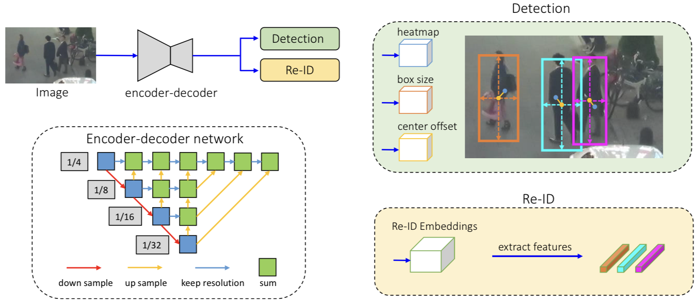
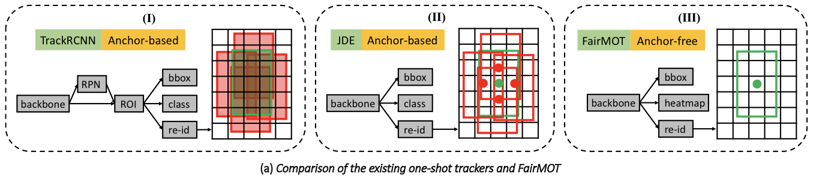
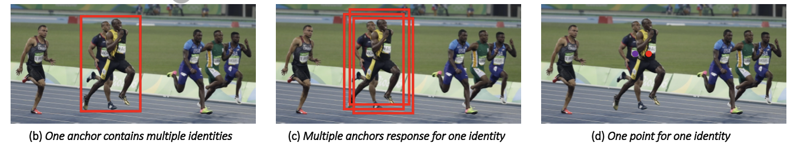
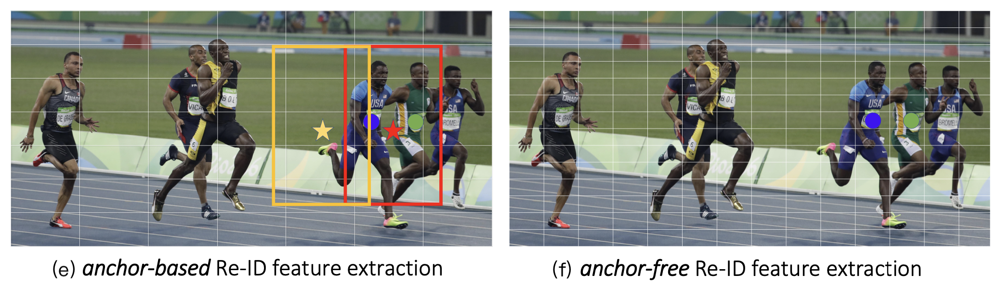

# FairMOT (On the Fairness of Detection and Re-Identification in Multiple Object Tracking, IJCV 2021)

[**arXiv preprint paper**](https://arxiv.org/abs/2004.01888)

[**GitHub**](https://github.com/ifzhang/FairMOT)

---

## 1. Introduction



**圖一**、FairMOT 概述。首先將輸入圖像送進編碼－解碼器（encoder-decoder），提取高分辨率特徵圖。接著使用兩個公平競爭的分支，分別用於目標檢測、重識別特徵提取。

大部分現有的方法都是採用兩個獨立的模型來解決多目標追蹤（Multiple Object Tracking, MOT）：**檢測模型**、**關聯模型**。

👉🏻 檢測模型：用於檢測出感興趣物件的邊界框

👉🏻 關聯模型：從邊界框圖像區域中提取重識別（re-ID）特徵

然而，因為環境中可能有大量物件，再加上兩個模型並不共享特徵，以及關聯模型需要針對每個物件進行特徵提取，使得這些方法幾乎無法達到實時的推斷速度。

隨著多任務學習（multi-task learning）的成熟，我們可以只使用單個網路來學習物件偵測、以及重識別特徵。不過將這兩個任務結合起來是一個複雜的任務，需要謹慎處理。

這篇文獻主要歸納出三個 one-shot tracker 失敗的原因，並提出簡單但有效率的解決方案：

1. [Caused by anchor](#31-unfairness-caused-by-anchors)
2. [Caused by feature sharing between the two tasks](#32-unfairness-caused-by-features)
3. [Caused by feature dimension](#33-unfairness-caused-by-feature-dimension)

## 2. Related Work

## 3. Unfairness Issues in One-shot Trackers



**圖二**、(a) Track R-CNN、JDE、FairMOT 架構比較，三種模型以不同方式提取重識別特徵。Track R-CNN 使用 ROI-Align 對所有正確的錨點提取重識別特徵；JDE 在所有正確錨點（紅框）的中心提取重識別特徵；FairMOT 在物體中心提取重識別特徵。



**圖二**、(b) 紅色錨點包含兩個不同的實例，因此必須預測兩個相衝突的類別。(c) 使用三個不同的錨點預測相同的身份。(d) FairMOT 僅在物體中心提取重識別特徵。



**圖二**、(e) 黃色、紅色錨點（黃色或紅色星星）負責估計相同的重識別特徵（藍色衣服的跑者）。此外，基於錨點的方法通常在粗糙的網格上操作，因此以錨點提取重識別特徵很可能與物體中心不對齊。(f) 不基於錨點的方法較不易受到不確定性的影響。

### 3.1. Unfairness Caused by Anchors

👉🏻 **忽略重識別任務**

在 [Track R-CNN](https://arxiv.org/abs/1902.03604) 中，模型會先估計物體的提議框，接著才從提議框中提取重識別特徵。這會讓模型專注於估計準確的提議框，而忽略了高質量的重識別特徵，造成學習任務上的不公平。

👉🏻 **一個錨點對應多個身份**

大多數基於錨點（anchor-based）的方法即是在提議框中提取重識別特徵。

然而，大多數錨點採樣的位置可能包含其他干擾物體或是背景。因此，從提議框中提取重識別特徵在準確性、區分性上都不是最佳的。因此作者在本文中提出，僅從單一點提取特徵，效果更好。

👉🏻 **多個錨點對應一個身份**

多個相鄰的錨點可能被迫估計相同的身份，這為模型訓練帶來了許多不確定性。另一方面，當圖像經過一個小擾動（例如數據增強），有可能導致相同的錨點需要用於估計不同的身份。

此外，目標檢測的特徵圖通常會被下採樣至 8/16/32 倍，但這對於學習重識別特徵來說太粗糙了，因為在粗糙的錨點上提取的特徵可能與物體中心不對齊。

### 3.2. Unfairness Caused by Features

對於 one-shot 追蹤器來說，目標檢測、重識別兩任務之間共享了大部分的特徵。但我們知道，目標檢測需要深層特徵來估計物體的類別和位置，而重識別需要淺層的外觀特徵來區分同一類別的不同物件。

### 3.3. Unfairness Caused by Feature Dimension

1. 高維度重識別特徵會與目標檢測相互競爭，進而影響目標檢測的準確性。
2. 多目標追蹤任務僅是在連續的兩幀影像中找出一對一的配對，因此不需要高維度特徵。（不過重識別任務需要在大量候選中進行匹配，因此高維度特徵是有其必要的。）
3. 低維度重識別特徵可以提升推斷時間。

## 4. FairMOT

[圖一](#1-introduction)為 FairMOT 網路模型之概觀，除了骨幹網路（Backbone Network）以外，尚包含一個物件偵測器和一個重識別特徵萃取器，兩個相互公平的分支。

### 4.1. Backbone Network

採用 ResNet-34 做為骨幹，並應用[深層聚合（Deep Layer Aggregation, DLA）](https://arxiv.org/abs/1707.06484)的增強版本，在低層級和高層級特徵之間增加了更多跳躍連接，類似於特徵金字塔網路（Feature Pyramid Network, FPN）。此外，所有的上採樣模塊中的卷積都使用可變形卷積（Deformable Convolution）取代，以根據物體的尺寸、姿態動態調整感受野。

最終輸出的特徵圖相較於原始影像僅下採樣 4 倍，而不是 32 倍。

### 4.2. Detection Branch

檢測分支是基於 [CenterNet](https://arxiv.org/abs/1904.07850) 建構的，在 DLA-34 的基礎上添加三個平行的頭：**熱圖**、**中心位置迴歸**、**尺寸迴歸**。

👉🏻 **4.2.1. Heatmap Head**：負責估計物體中心位置。

這裡採用基於熱圖的表示方式，其中熱圖的維度為 $`1 \times H \times W`$。

在熱圖中的某個位置，若與真實物體中心一致，則響應值應該為 $`1`$；隨著熱圖位置與真實物體中心之間的距離增加，響應值成指數衰減。因此熱圖響應值可以表示為：

```math
M_{xy} = \sum_{i=1}^{N} \exp \left( - \frac{\left( x - \tilde{c}^i_x \right)^2 + \left( y - \tilde{c}^i_y \right)^2}{2 \sigma^2_c} \right)
```

💡 物體邊界框 $`\mathbf{b}^i = ( x^i_1, y^i_1, x^i_2, y^i_2 )`$，物體中心 $`( c^i_x, c^i_y ) = \left( \frac{x^i_1+x^i_2}{2}, \frac{y^i_1+y^i_2}{2} \right)`$，特徵圖上的物體中心 $`( \tilde{c}^i_x, \tilde{c}^i_y ) = \left( \left\lfloor \frac{c^i_x}{4} \right\rfloor, \left\lfloor \frac{c^i_y}{4} \right\rfloor \right)`$。

計算出熱圖後，採用像素級的 Focal Loss 作為目標函數：

```math
L_{\text{heat}} = -\frac{1}{N}\sum_{xy}\left\{\begin{matrix*}[l]( 1-\hat{M}_{xy})^{\alpha}\log( \hat{M}_{xy}) & , & M_{xy} = 1 \\ ( 1-M_{xy})^{\beta}(\hat{M}_{xy})^{\alpha}\log( 1-\hat{M}_{xy}) & , &\text{otherwise} \end{matrix*}\right.
```

👉🏻 **4.2.2. Box Offset and Size Heads**：負責更準確地估計位置中心（中心偏移）以及邊界框的長寬。

將邊界框尺寸、中心偏移量表示為 $`\hat{S} \in \mathbb{R}^{2 \times H \times W}`$ 和 $`\hat{O} \in \mathbb{R}^{2 \times H \times W}`$，則 ground truth 可以表示為：

```math
\left\{\begin{matrix*}[l]\mathbf{s}^i = \left(x^i_2-x^i_1, y^i_2-y^i_1 \right) \\ \mathbf{o}^{i} = \left( \frac{c^i_x}{4}, \frac{c^i_y}{4} \right) - \left( \left\lfloor \frac{c^i_x}{4} \right\rfloor, \left\lfloor \frac{c^i_y}{4} \right\rfloor \right)\end{matrix*}\right.
```

接著使用 L1 誤差作為目標函數：

```math
L_{\text{box}} = \sum ^N _{i=1} \left\| \mathbf{o}^i - \hat{\mathbf{o}}^i \right\|_1 + \lambda_s\left\| \mathbf{s}^i - \hat{\mathbf{s}}^i \right\|_1
```

### 4.3. Re-ID Branch

重識別分支用於生成可區分物體的特徵。理想狀況下，相同目標估計出來的特徵要越近越好；不同目標估計出來的特徵要越遠越好。

為了實現這一個目標，作者將 $`128`$ 個核心的卷積層應用在 DLA-34 的特徵圖上，用於提取每個位置的重識別特徵。此一分支的輸出特徵圖為 $`\mathbf{E} \in \mathbb{R}^{128 \times H \times W}`$，其中物件中心為 $`(x, y)`$ 的重識別特徵可以從特徵圖中提取為 $`\mathbf{E}_{x,y}\in\mathbb{R}^{128}`$。

👉🏻 **4.3.1. Re-ID Loss**

作者直接將重識別特徵學習的問題轉化成分類問題，將所有相同身份的實例視為相同類別。

對於每一個目標，我們可以透過其在熱圖上的目標中心來提取重識別特徵 $`\mathbf{E}_{\tilde{c}^i_x, \tilde{c}^i_y}`$，接著使用全連接層（Fully Connected Layer）以及歸一化指數函數（Softmax）將重識別特徵映射至類別分佈向量 $`\mathbf{P}=\left\{ \mathbf{p}(k), k \in \left[ 1, K \right] \right\}`$。若將類別標籤的 one-hot 表示為 $`\mathbf{L}^i(k)`$，則重識別任務的誤差函數可以表示為：

```math
L_{\text{identity}} = -\sum_{i=1}^{N} \sum_{k=1}^{K} \mathbf{L}^i(k)\log(\mathbf{p}(k))
```

其中 $`K`$ 是訓練資料中的身份個數。

### 4.4. Training FairMOT

使用[不確定性損失](https://arxiv.org/abs/1705.07115)方法將上述誤差相加，以自動平衡檢測和重識別任務：

```math
L_{\text{detection}} = L_{\text{heat}} + L_{\text{box}}
```

```math
L_{\text{total}} = \frac{1}{2}\left( \frac{1}{e^{w_{1}}}L_{\text{detection}} + \frac{1}{e^{w_{2}}}L_{\text{identity}} + w_{1} + w_{2}\right)
```

具體而言，只要給定一張包含數個物體及其相應的 ID 的圖像時，模型便能生成熱圖、邊界框大小、邊界框偏移、物件的 one-hot 表示。將這些估計值與 ground truth 計算損失，便能訓練整個網路。

### 4.5. Online Inference

👉🏻 **4.5.1. Network Inference**

👉🏻 **4.5.2. Online Association**

## 5. Experiments
